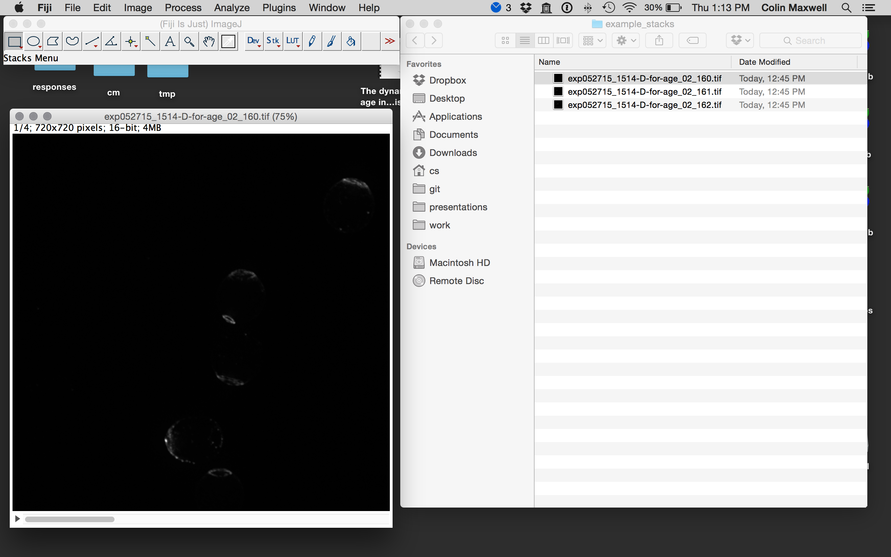
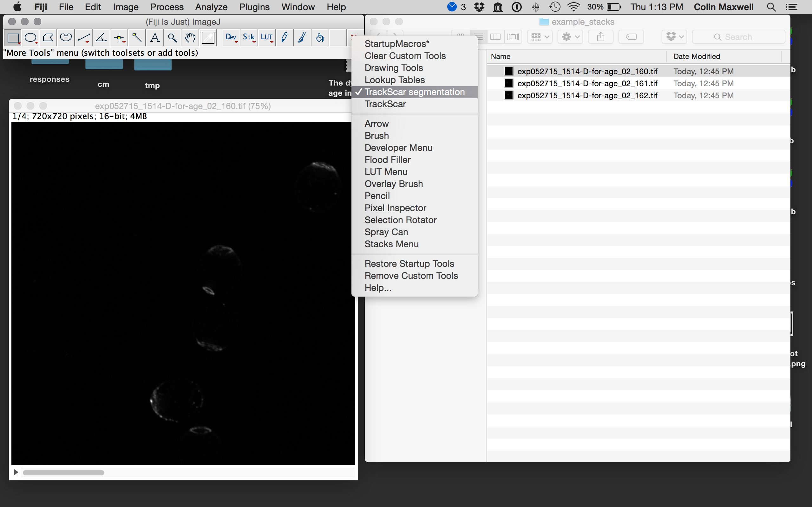
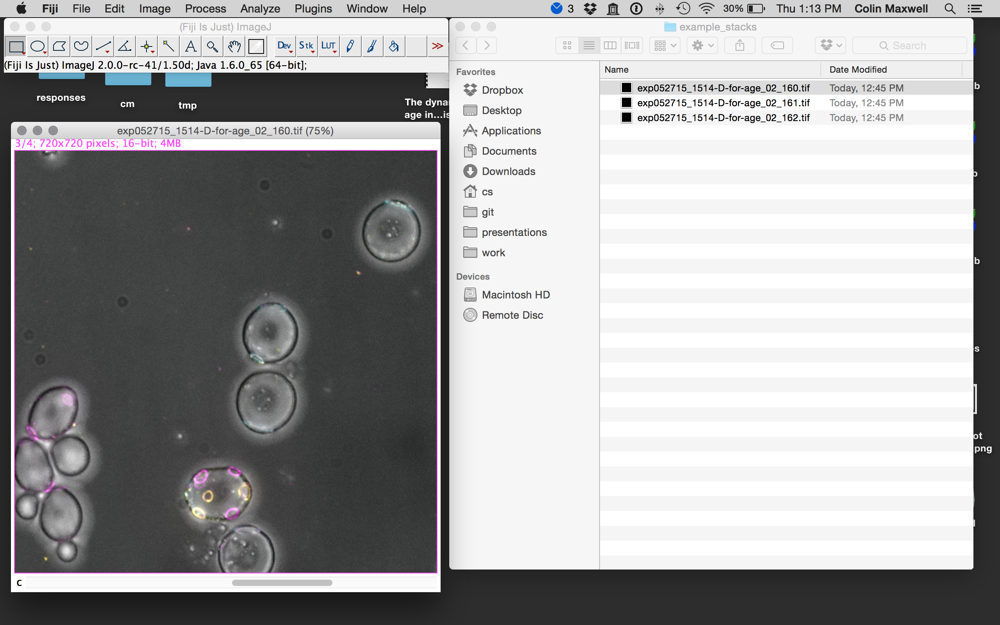
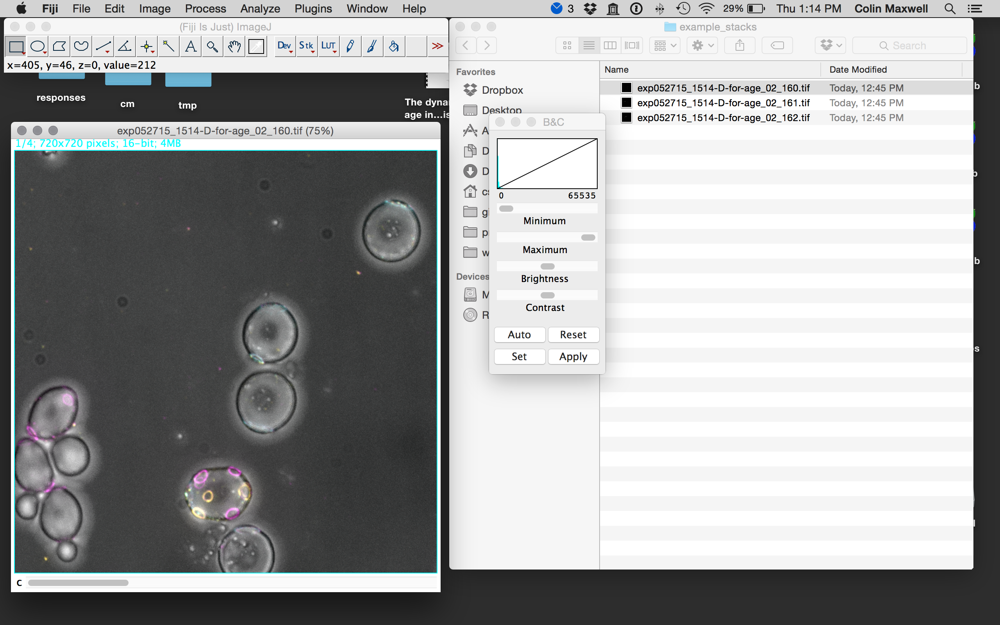

# TrackScar imageJ macros

This repo contains toolsets to help with budscar counting for TrackScar.

# Installation

## Without git

Download the source for this repo. The folder should contain several `.txt` files, including two called `TrackScar segmentation.txt` and `TrackScar.txt`. There are also two files called: `makeCountList` and `mergeDV`. These files need to be installed into Fiji by copying them into its `toolsets` folder.

On a Mac, right click on the `Fiji.app` file in the `Applications` folder. Select `Show Contents`. Navigate to the folder `macros` and then to the folder `toolsets`. Copy the files `TrackScar segmentation.txt` and `TrackScar.txt` to the toolsets folder. Then restart Fiji.

Add the path to the macros folder to your .bash_profile. On my machine, the relevant line to add was:

`export PATH="/Applications/Fiji.app/macros/toolsets:$PATH"`

## With git

To install, delete the 'macros/toolsets' folder in Fiji and replace it with a clone of this repo.

`
cd path/to/macros
git clone https://bitbucket.org/csmaxwell/fiji-toolsets.git toolsets
`
Add the path to the macros folder to your .bash_profile. On my machine, the relevant line to add was:

`export PATH="/Applications/Fiji.app/macros/toolsets:$PATH"`

# Usage

## Workflow

- Collect data on a DeltaVision microscope, ensuring that the files are named so that they are compatible with the naming convention described below.
- Run the script `mergeDV` to create TIFF stacks out of the raw tif files.
- Open Fiji and use the `TrackScar segmentation` toolset to crop individual cells.
- Run the `makeCountList` script to create an excel file to record the data
- Use the `TrackScar` toolset to iterate through the cropped images, and record the number of buds present in each channel of the images.

## File naming

In a TrackScar experiment, the microscope collects Z-stacks of several different channels corresponding to the different fluorophores used in the TrackScar staining. The stacks are then projected by the DeltaVision software using a maximum projection, so there is a single maximum projection stack for each channel. These projections are labeled by the wavelength of the emission filter.  By convention, I have always used Ax488 (w525) first, Cy5 second (w676), and Tetramethylrhodamine third (w594). I also collect brightfield images (w-50). Therefore, for each position in a three color TrackScar experiment, there will be four images. In the example folder, I've included the projections for three different points in a three-color TrackScar experiment. The files are labelled by the following convention: `EXPERIMENT_SAMPLE_SERIES_POINT_R3D_D3D_PRJ_WAVELENGTH.tif`. For example, one of the images in the examples is called: `exp052715_1514-D-for-age_02_160_R3D_D3D_PRJ_w-50.tif`. Of this filename, the DeltaVision microscope automatically adds the `SERIES_POINT_R3D_D3D_PRJ_WAVELENGTH.tif` part, so you only need to make sure that your file names always have exactly one underscore that separates the experiment ID from the sample ID.

## mergeDV

This is a python script that is designed to process images created by a DeltaVision microscope. It will not work for other file formats, and the naming convention describe above must be followed exactly for it to work. **This script requires ImageMagick to be installed.**.

The script takes a folder containing `.tif` files produced as above, and produces tifstacks that can then be processed using Fiji. To process the images in the examples folder, navigate in the finder to the folder containing the examples folder and run the following command:

`mergeDV --channels "w525 w676 w594 w-50" examples example_stacks`

This should produce filenames that look like this: `exp052715_1514-D-for-age_02_160.tif`. The extraneous information is removed from the filenames.

Note that the channels were specified using spaces in the order in which the dyes were applied. If you change the order of the dyes (e.g. "w525 w676 w-50 w594"), then the tiffstack will have the slices in the wrong order, and you will be confused when you try to count the budscars.

## TrackScar segmentation

Note: you have to run `mergeDV` first as above. The goal of this is to crop individual cells have been stained with the first color of TrackScar so that the budscars can be easily counted. 

The TrackScar segmentation macro defines the following shortcuts:

- `c` This converts the file into a colorized overlay.
- `6` Show only the first channel of TrackScar
- `7` Show first two channels of TrackScar
- `8` Show first three channels of TrackScar
- `9` Show first four channels of TrackScar
- `0` Open the next image. This applies the brightness and contrast in the current image to the next one.
- `i` Crop and save. This crops whatever is selected in the image and assigns it to a new file. The macro keeps track of how many cells you have cropped and names the new image accordingly.
- `r` Make a 250x250 rectangle for cropping.

### Example workflow

Open the first file in the `example_stacks` folder (`exp052715_1514-D-for-age_02_160.tif`). You should see a tif stack with four slices that correspond to the four different images:

.

Select the TrackScar segmentation Toolset:

Type `c` to colorize the image. Note that the color order is cyan-yellow-magenta-grey.

The only channels we care about are the first and the last (cyan and grey) because they show the presence of the first stain and the outline of the cell, respectively. However, let's adjust the contrast for all of the channels as if we were going to count the buds.

Type `command-shift-c`. This should pull up a window to adjust the brightness and contrast:

 

